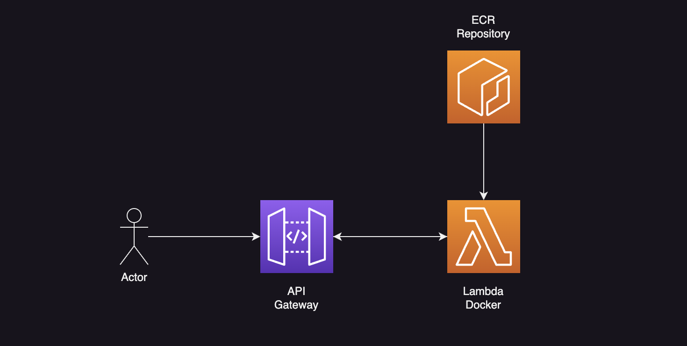
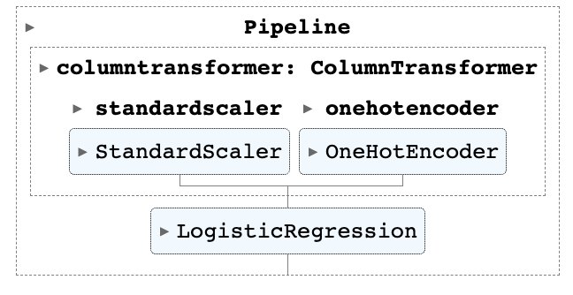
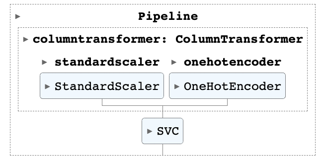

# Flights

## Introduction

This repository provides an ML solution to calculate the probability of delays in arrival or departure for flights that depart from Santiago de Chile.

It uses Scikit-Learn as the main library for creating the model, Fast-API to serve, and Mangum to create an AWS lambda function with the code.

It also uses terraform to define the infrastructure needed.



This infrastructure uses an API Gateway as an entry point, a serverless solution ensuring scalability.

Then, a Lambda Function is responsible for loading the model and running inference.

The Lambda uses a Docker image with the code, and we store this image in ECR.

A CI/CD process is implemented with GitHub Actions, which builds the image and pushes it to ECR.

## The Data

I fetched data from [Aviation Stack](https://aviationstack.com/). This API haves historical data on previous flights.

I built a dataset of 1,000 samples for flights that depart from SCL.

The data is stored as a Parquet file in the folder data of this repository.

The columns of interest for my experiments were:

```
[
    'flight_number',
    'airline_iata',
    'iata_departure',
    'scheduled_departure',
    'actual_departure',
    'iata_arrival',
    'scheduled_arrival',
    'actual_arrival',
    'delay_departure',
    'delay_arrival',
    'flight_day',
    'flight_month',
    'flight_year',
    'delayed_departure',
    'delayed_arrival'
]
```

Here, I assumed the flight would be delayed if the delay was greater than 25 minutes. This assumption applies to arrivals and departures.

## The Model

I tested two machine-learning models:
- SVC.
- Logistic Regression.

The best results for each problem (arrivals and departures) were:
- Logistic Regression for Departures
- SVC for Arrivals

The models are defined in the following way:

There are two preprocessing steps:

- One Hot Encoding (For categorical variables)
- Standar Scaler (For numerical variables)

### Departures Model

The model for departures is as follows:

<p align="center">
    
</p>

Metrics obtained:

```bash
Accuracy: 0.833333
Precision: 0.833333
Recall: 0.365854
F1: 0.508475
```

### Arrivals Model

The model for arrivals is as follows:

<p align="center">
    
</p>

Metrics obtained:

```bash
Accuracy: 0.816092
Precision: 0.819767
Recall: 0.992958
F1: 0.898089
```

## The API

I used FastAPI to create the inference API. This API has two endpoints:
- `arrivals`
- `departures`

To test the API locally you need to follow the next steps:

1. Install requirements
```
pip install -r requirements.txt
```
2. Run the API with `uvicorn`
```
uvicorn app.main:app --reload
```

#### Query example:

You can use cURL to test the API
```bash
curl --location 'localhost:8000/arrivals' \
--header 'Content-Type: application/json' \
--data '{
    "airline_iata": "AV",
    "iata_arrival": "BOG",
    "flight_day": 21,
    "flight_month": 6,
    "flight_year": 2023
}'
```
Reponse Example:
```json
{
    "probability": 0.8779077133227141,
    "prediction": 1
}
```

Here, if the probability is greater than 0.5, the prediction shows that the flight will be delayed.

Check the API documentation in the following endpoint:

```bash
http://localhost:8000/docs
```

### Testing with Docker

Build the image:

```bash
docker build -t flights -f ./docker/Dockerfile .
```

Run the image:
```bash
docker run --rm -p 9000:8080 flights:latest
```

The Dockerfile provided in this repository is intended to run inside a lambda function, therefore to test locally the cURL query is different:

```bash
curl --location 'http://localhost:9000/2015-03-31/functions/function/invocations' \
--header 'Content-Type: application/json' \
--data '{
    "resource": "/arrivals",
    "path": "/arrivals",
    "httpMethod": "POST",
    "headers": {
        "Accept": "*/*",
        "Accept-Encoding": "gzip, deflate",
        "cache-control": "no-cache",
        "CloudFront-Forwarded-Proto": "https",
        "CloudFront-Is-Desktop-Viewer": "true",
        "CloudFront-Is-Mobile-Viewer": "false",
        "CloudFront-Is-SmartTV-Viewer": "false",
        "CloudFront-Is-Tablet-Viewer": "false",
        "CloudFront-Viewer-Country": "US",
        "Content-Type": "application/json",
        "headerName": "headerValue",
        "Host": "gy415nuibc.execute-api.us-east-1.amazonaws.com",
        "Postman-Token": "9f583ef0-ed83-4a38-aef3-eb9ce3f7a57f",
        "User-Agent": "PostmanRuntime/2.4.5",
        "Via": "1.1 d98420743a69852491bbdea73f7680bd.cloudfront.net (CloudFront)",
        "X-Amz-Cf-Id": "pn-PWIJc6thYnZm5P0NMgOUglL1DYtl0gdeJky8tqsg8iS_sgsKD1A==",
        "X-Forwarded-For": "54.240.196.186, 54.182.214.83",
        "X-Forwarded-Port": "443",
        "X-Forwarded-Proto": "https"
    },
    "multiValueHeaders": {
        "Accept": [
            "*/*"
        ],
        "Accept-Encoding": [
            "gzip, deflate"
        ],
        "cache-control": [
            "no-cache"
        ],
        "CloudFront-Forwarded-Proto": [
            "https"
        ],
        "CloudFront-Is-Desktop-Viewer": [
            "true"
        ],
        "CloudFront-Is-Mobile-Viewer": [
            "false"
        ],
        "CloudFront-Is-SmartTV-Viewer": [
            "false"
        ],
        "CloudFront-Is-Tablet-Viewer": [
            "false"
        ],
        "CloudFront-Viewer-Country": [
            "US"
        ],
        "": [
            ""
        ],
        "Content-Type": [
            "application/json"
        ],
        "headerName": [
            "headerValue"
        ],
        "Host": [
            "gy415nuibc.execute-api.us-east-1.amazonaws.com"
        ],
        "Postman-Token": [
            "9f583ef0-ed83-4a38-aef3-eb9ce3f7a57f"
        ],
        "User-Agent": [
            "PostmanRuntime/2.4.5"
        ],
        "Via": [
            "1.1 d98420743a69852491bbdea73f7680bd.cloudfront.net (CloudFront)"
        ],
        "X-Amz-Cf-Id": [
            "pn-PWIJc6thYnZm5P0NMgOUglL1DYtl0gdeJky8tqsg8iS_sgsKD1A=="
        ],
        "X-Forwarded-For": [
            "54.240.196.186, 54.182.214.83"
        ],
        "X-Forwarded-Port": [
            "443"
        ],
        "X-Forwarded-Proto": [
            "https"
        ]
    },
    "queryStringParameters": {},
    "multiValueQueryStringParameters": {},
    "pathParameters": {},
    "stageVariables": {
        "stageVariableName": "stageVariableValue"
    },
    "requestContext": {
        "accountId": "12345678912",
        "resourceId": "roq9wj",
        "stage": "testStage",
        "requestId": "deef4878-7910-11e6-8f14-25afc3e9ae33",
        "identity": {
            "cognitoIdentityPoolId": null,
            "accountId": null,
            "cognitoIdentityId": null,
            "caller": null,
            "apiKey": null,
            "sourceIp": "192.168.196.186",
            "cognitoAuthenticationType": null,
            "cognitoAuthenticationProvider": null,
            "userArn": null,
            "userAgent": "PostmanRuntime/2.4.5",
            "user": null
        },
        "resourcePath": "/arrivals/",
        "httpMethod": "GET",
        "apiId": "gy415nuibc"
    },
    "body": "{\"airline_iata\":\"AV\", \"iata_arrival\": \"BOG\",\"flight_day\": 21,\"flight_month\": 6,\"flight_year\": 2023}",
    "isBase64Encoded": false
}'
```

And the response should look like:

```json
{
  "statusCode": 200,
  "headers": {
    "content-length": "48",
    "content-type": "application/json"
  },
  "multiValueHeaders": {},
  "body": "{\"probability\":0.877907713322714,\"prediction\":1}",
  "isBase64Encoded": false
}
```

## Bulding the Infrastructure in AWS

To build the infrastructure in AWS we use Terraform.

First, create a `secrets.auto.tfvars` file inside the terraform folder with the following contents:

```bash
access_key = "<YOUR-ACCESS-KEY>"
secret_key = "<YOUR-SECRET-KEY>"
```

Then:

```bash
cd terraform
terraform apply
```

The first apply will fail but it will create the ECR repository. Then you need to run the GitHub Action script in the repository. Be sure to set your secrets in the repository.

```bash
AWS_ACCESS_KEY_ID: <YOUR-ACCESS-KEY> 
AWS_SECRET_ACCESS_KEY: <YOUR-SECRET-KEY>
```

After setting the secrets run the action and the image will be pushed to ECR. Then run `terraform apply` again.

Now you have the API running on AWS! You can query it using the URL provided by API Gateway.

Go to: API Gateway > flights > stages > dev

You should see an URL that looks like:

```bash
https://<UNIQUE-IDENTIFIER>.execute-api.us-east-1.amazonaws.com/dev
```

Then you can query the endpoints with:

```bash
curl --location 'https://<UNIQUE-IDENTIFIER>.execute-api.us-east-1.amazonaws.com/dev/arrivals' \
--header 'Content-Type: application/json' \
--data '{
    "airline_iata": "AV",
    "iata_arrival": "BOG",
    "flight_day": 21,
    "flight_month": 6,
    "flight_year": 2023
}'
```

## API Stress Test

This section explains how a stress test was performed on the API.

100 requests were sent to the API locally and using API Gateway.

### Locally

The results for the API running locally with `uvicorn` are as follows:

```bash
Execution Time (mean) 0.0042 seconds
Execution Time (std) 0.0012 seconds
```

### API Gateway

The results for the API running in AWS are as follows:

```bash
Execution Time (mean) 0.4560 seconds
Execution Time (std) 0.1819 seconds
```

## Conclusions

The model can be improved in several ways to enhance its predictive performance. Here are some potential avenues for improvement:

1. **Feature Engineering**: The current model utilizes a set of predefined features to predict flight delays. However, there may be additional features or derived features that could provide valuable information for the prediction task. Exploring and incorporating relevant features such as weather conditions, airline-specific factors, or airport congestion levels could potentially improve the model's accuracy.

2. **Data Augmentation**: Increasing the size and diversity of the training dataset can help improve the model's generalization and predictive power. Additional historical flight data from various sources or time periods could be incorporated to enhance the dataset and capture a wider range of scenarios and patterns.

3. **Model Selection and Hyperparameter Tuning**: While the logistic regression and SVC models were tested in this repository, other machine learning algorithms or even ensemble methods could be explored to find a model that better captures the underlying patterns and relationships in the data. Additionally, performing a thorough hyperparameter search and tuning process could optimize the model's performance.